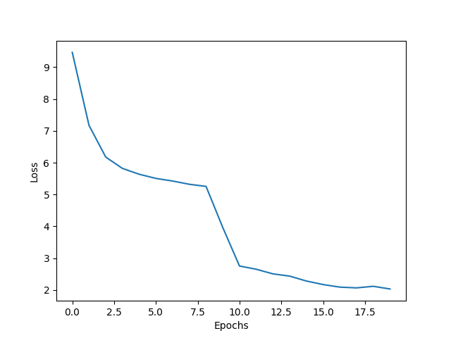

# CNN_from_scratch

This is a simple implementation of a convolutional neural network from scratch using only numpy. The network is trained on the NumtaDB dataset. 

## Installation
1. Clone the repository
2. Install the requirements
3. download the dataset from [here](https://www.kaggle.com/c/numta/data) and extract it in the root directory of the project

## Usage
1. Training the model
    * specify the environment variables and hyperparameters in the env.py file
    * run the train.py file `python train.py`, this will train the model on training-a.csv, training-b.csv and training-c.csv
    * following 3 files will be generated in the root directory
        * model_name.pickle
        * accuracy_vs_epoch.png
        * loss_vs_epoch.png
        * f1_score_vs_epoch.png

2. Testing the model
    * keep the model_name.pickle file in the root directory
    * specify the environment variables in the env.py file
    * refactor the test.py file to load the model_name.pickle file and the test images directory/csv file path
    * run the test.py file `python test.py test_images_directory`, this will test the model on the test_images_directory
    * run the test.py file `python test.py test_images_csvfile`, this will test the model on the csv file containing the test images details
    * this will generate a csv file containing the predicted labels of the test images in the root directory '1705100_prediction.csv'

## Results
* The model in results folder (lenet.pickle) was trained on 
    * train set: 35487 images
    * validation set: 8872 images

    * learning rate: 0.01
    * batch size: 64
    * epochs: 20

    * training accuracy: -
    * validation accuracy: 89.91%
    * validation macro-f1 score: 0.899
    * test accuracy: 88.955%

    ### Epoch vs Accuracy plot:  
    

    ### Epoch vs Loss plot: 
    

    ### Epoch vs Macro F1 score plot: 
    